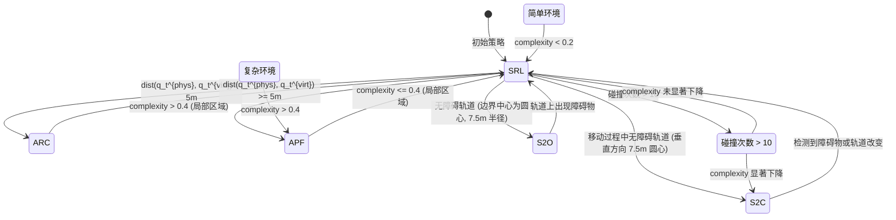

# 重定向行走大作业报告

> 周子恒 计 24, 张皓晨 计 24, 黄宸宇 计 23

我们实现了控制器 S2C、S2O、APF、SRL、ARC，并且编写了随机生成虚拟、物理行走环境的脚本，支持标准矩形和多边形图形边界与障碍物的生成。此外我们编写了随机生成行走路径的脚本，并且编写了多种路径的模拟脚本，并绘制了行走图像，进行了数据统计。

## 使用方法

- 后端启动

```cmd
python client_base.py
```

- 前端启动

```cmd
uvicorn main:app --host 0.0.0.0 --port 8000 # remember to open port8000 to public IP
```

- 环境随机生成

```cmd
python enviroment_generator.py
```

- 路径随机生成

```cmd
bash path_generator.sh
```

- 路径模拟与图像绘制

```cmd
bash test.sh # Linux/MacOS
.\test.bat # Windows
```

## 实现的功能

### S2C

S2C 的策略是让用户朝着物理环境中心走。用户会基于当前视角与当前位置到中心的角度，选择更小的旋转方向进行转向，因此只要用户转到了朝着物理环境中心的方向，就能保证用户朝着物理环境中心走。更进一步地，为了让转向角更小，我们设置了临时转向点。如果当前方向与目标方向大于 160 度，则一直选择临时转向点；否则，选择中心点进行转向。


图示为用户在虚拟环境中走直线，物理环境下用户的行走轨迹。我们取曲率增益为 7.5m，用户在经过中心前一直朝着物理环境中心走，经过之后用户会转向到临时转向点，最终会画圆回到中心。

### S2O

S2O 的核心思想是通过确定物理环境中的中心点，给定一个以中心点为圆心的轨道圆，半径为 5m。对于物理环境中的用户，如果用户处于圆轨道之外，则过当前位置对圆轨道做两条切线，切点为用户选择转向的点。然后按用户当前物理视角 `user.angle` 与转向点的角度差，选取较小者进行转向；对于轨道内的用户，则做一条经过圆心与用户当前位置的直线，然后以圆心为轴，顺、逆时针旋转 60 度，选择转向方向，同样选择转向角度较小者。用户每走一步，都需要更新转向点。


图示为用户在虚拟环境中走直线，物理环境下用户的行走轨迹。我们取曲率增益为 7.5m，因此轨迹半径为 7.5m 的包络圆。

### APF

> Thomas, J., & Rosenberg, E. S. (2019, March). A general reactive algorithm for redirected walking using artificial potential functions. In 2019 IEEE Conference on Virtual Reality and 3D User Interfaces (VR) (pp. 56-62). IEEE.

APF 的策略是使用人工势能函数给出的负梯度方向来指引用户远离潜在的碰撞。文章定义了一个势能函数，公式如下：

$$
U(x)=\frac{1}{2}||x- x_{goal}||+\sum_{ob \in O} \frac{1}{||x-x_{ob}||}
$$

其中 $x_{goal}$ 定义为虚拟环境中想要将用户引导到的点的坐标，$x_{ob}$代表每一个障碍物的坐标，以上两部分分别定义为牵引力与排斥力的势能，文章中主要关注势能的定义相较于 S2C 带来的增益，所以并没有实现牵引力的部分，我们组也按照论文的方法来实现。

具体实现为：计算用户到边界和每个障碍物的距离，并根据势能函数的定义算出其负梯度方向，当用户前进方向与负梯度方向一致时，给予最小的平移增益，相反时，给予最大的平移增益，当出现用户运动方向跟负梯度方向有夹角的情况，则根据叉乘结果判断旋转方向，使得用户运动方向向负梯度方向偏转，这样可以引导用户沿负梯度方向移动，从而达到远离障碍物的效果。

除实验具体方案以外，文章还提出了三种 reset 策略，我们也分别加以实现，它们分别是：
* MR2C：向中心重定向，当用户是由于碰撞到与中心连线方向上的障碍物而 reset 时，则沿与障碍物边界平行的方向重定向
* R2G：沿负梯度方向重定向
* SFR2G：沿负梯度方向前进几步后得到的点作为标记点，朝标记点方向重定向

下面的示例图是应用 MR2C reset 策略的运行截图，以及该环境负梯度场示例图


### SRL

### ARC

ARC 的策略是考虑现实环境与虚拟环境的对齐程度来调整增益策略。具体而言，定义 $d(p,\theta)$ 表示位置 $p$ 在当前环境下 $\theta$ 方向距离最近障碍物、边界的距离，我们定义对齐程度为：

$$
\begin{align*}
\text{dist}(q_t^{phys}, q_t^{virt}) = & \; |d(p_{phys}, \theta_{phys}) - d(p_{virt}, \theta_{virt})| \\
& + |d(p_{phys}, \theta_{phys} + 90^\degree) - d(p_{virt}, \theta_{virt} + 90^\degree)| \\
& + |d(p_{phys}, \theta_{phys} - 90^\degree) - d(p_{virt}, \theta_{virt} - 90^\degree)|
\end{align*}
$$

当 $\text{dist}(q_t^{phys}, q_t^{virt})>0$ 时，应用重定向策略，否则认为虚拟与现实环境对齐。具体增益策略如下：

$$g_t = \text{clamp}(\frac{d(p_{phys}, \theta_{phys})}{d(p_{virt}, \theta_{virt})}, \text{minTransGain}, \text{maxTransGain})$$

平移增益如上，其中 $\text{minTransGain}$ 和 $\text{maxTransGain}$ 分别为 0.86 和 1.26。曲率增益如下：

$$
\begin{align*}
\text{misalignLeft} = d(p_{phys}, \theta_{phys} + 90^\degree) - d(p_{virt}, \theta_{virt} + 90^\degree), \\
\text{misalignRight} = d(p_{phys}, \theta_{phys} - 90^\degree) - d(p_{virt}, \theta_{virt} - 90^\degree). \\
\end{align*}
$$

如果 $\text{misalignLeft} > \text{misalignRight}$，则应用左曲率增益；否则应用右曲率增益。我们有：

$$
\begin{align*}
\text{scalingFactor} = \text{min}(1, \text{misalignLeft}), \\
g_c = \text{max}(\text{minCurvGain}, \frac{\text{minCurvGain}}{\text{scalingFactor}})
\end{align*}
$$

其中 $minCurvGain$ 为 7.5m。旋转增益如下：

$$
\begin{align*}
\text{curRotaAlignment} = \text{dist}(q_t^{phys}, q_t^{virt}), \\
\text{prevRotaAlignment} = \text{dist}(q_{t-1}^{phys}, q_{t-1}^{virt}). \\
\end{align*}
$$

$$
g_r =
\begin{cases}
\text{minRotaGain} & \text{if } \text{curRotaAlignment} < \text{prevRotaAlignment}, \\
\text{maxRotaGain} & \text{if } \text{curRotaAlignment} > \text{prevRotaAlignment}, \\
1 & \text{otherwise.}
\end{cases}
$$

其中 $\text{minRotaGain}$ 和 $\text{maxRotaGain}$ 分别为 0.67 和 1.24。

最后是 reset 策略，当距离障碍物只有 0.7m 时，选择 20 个固定方向，分别计算 $d(p_{phys}, \theta_{i})$，选择障碍物的反方向并且距离最远的方向进行重置。


图为 ARC 策略在虚拟环境中从下方中间位置走直线向着左上角前进，物理环境下用户从下方中间开始的行走轨迹。由于一直不能保持对齐，因此 ARC 策略会导致用户一直转向，重定向时也是朝着与墙垂直的方向。


图为虚拟环境与现实环境完全一致的情况，可见前段时间物理环境下用户走的也是直线。但由于细微角度偏差带来的问题，ARC 策略仍然会导致用户转向。

## 方法效果基准测试

我们实现了环境与路径生成和测试脚本，在多个环境下测试了不同策略的效果。通过对比不同策略的效果，我们可以发现：

- 在中间较为空旷时，S2O 与 S2C 策略效果很好，但只要物理环境中间有障碍物时，策略就会失效，因为策略没有考虑障碍物的影响，一旦中间有障碍物就会导致大量的 reset。


- S2O 一定程度上可以规避中心、边缘位置有障碍物的情况，但如果其旋转轨道上有障碍物，则会导致大量的 reset。

- S2C 策略在某一侧障碍物不集中，并且中心无障碍时效果较好，这时 S2C 会朝着固定轨道运动。但如果障碍物集中，则会导致大量的 reset。


- 大部分情况下 APF 策略效果不错，能够适应局部最优策略来计算斥力，但如果用户处于障碍物密集区，则会导致用户落入了局部最优区，无法探测到整体物理环境和整体最优区域。这时如果中间区域空旷， S2O 策略效果会更好。


- ARC 策略在环境复杂时效果会好一些，因为它也考虑到了局部最优策略，并且环境越复杂，其对齐程度越可能高，因此 ARC 策略的效果会更好。但如果环境比较简单，则 ARC 策略就会出问题。考虑虚拟与现实环境都十分空旷，此时其他策略都不会失效，但如果 ARC 的虚拟和现实位置不同步，则 ARC 会不断应用增益进行转向，并且也很难调整到对齐位置，于是会造成很多 reset。

- SRL 在一张固定的图上训练效果很不错，但如果环境变化很大，则 SRL 的迁移能力会不行。限于硬件资源问题，我们只训练了 SRL 在空旷环境下的效果，如果物理环境中心部分足够空旷，则 SRL 表现效果十分优秀，但如果物理环境中心部分有障碍物，则 SRL 表现效果会很差。但如果考虑到 SRL 的迁移能力，我们在足够复杂的环境下，涉及到局部空旷、局部狭长、局部复杂的情况，SRL 表现效果应该会更好。


## 自适应控制器

结合上述的测试结果，我们提出了自适应控制器的设计。自适应控制器的核心思想是根据当前环境的复杂程度，动态调整增益策略，使得控制器能够在不同的环境中获得最佳的控制效果。具体地，我们设计了以下自适应策略：

- 环境复杂度评估：我们定义环境复杂度为：

  $$
  \text{complexity} = \frac{1}{\text{boderArea}} \cdot \sum_i^\text{numObstacles}\text{area}_i
  $$

  其中 $\text{boderArea}$ 为环境的面积，$\text{area}_i$ 为每个障碍物的面积，$\text{numObstacles}$ 为障碍物的数量。

  环境复杂度越高，则增益策略越复杂，反之则越简单。

首先，我们有 S2C、S2O、APF、SRL、ARC 五种策略，我们动态地在不同环境下调整策略。通常情况下，我们选用经过足够训练后的 SRL 策略。

- 我们的 SRL 策略应在足够复杂的环境下训练，物理区域面积需要足够大，要包含复杂障碍堆积，但有单向出口或狭长出口的情况，需要包含有局部空旷区域的情况，还需要包含障碍物随机分布的随机情况。

- 当 $\text{complexity} < 0.2 $ 时，我们认为环境比较简单，直接应用 SRL 策略。

- 我们每次都可以考虑计算 ARC 策略中的对齐情况，如果对齐情况 $\text{dist}(q_t^{phys}, q_t^{virt}) < 5m$，则应用 ARC 策略，否则应用 SRL 策略。

- 我们同时可以考虑用户当前物理环境下的 15*15m 的局部区域，当局部区域内 $\text{complexity} > 0.4 $ 时，我们认为环境比较复杂，则应用 APF 策略。

- 对于以边界中心为圆心，7.5m 为半径的轨道上没有障碍物的情况，我们可以考虑使用 S2O 策略，这样可以保证用户在轨道上行走。

- 移动过程中，我们动态地检查当前位置，以用户当前方向的垂直方向 7.5m 位置为圆心的圆轨道上是否有障碍物，如果没有障碍物，则应用 S2C 策略。

- 应用任意策略时，如果碰撞次数 > 10，则认为目前局部环境比较复杂，并非最优，我们考虑扩大搜索范围，如果 $\text{complexity}$ 有显著下降，则应用 S2C 策略尝试跳出当前环境。如果没有显著下降，则认为环境依然十分复杂，交给 SRL 策略。

